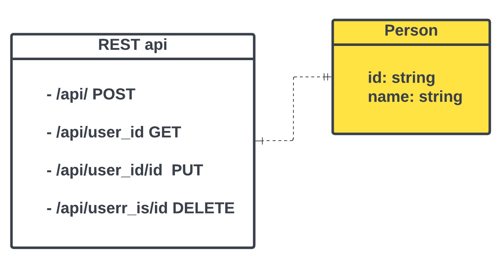

# A simple REST API capable of CRUD(Create, Read, Update, Delete) operations on a "person" resource.

This project provides a simple REST API for managing person COLLECT, allowing you to perform CRUD  operations. This README.md file contains detailed instructions on setting up, running, and using the API.

> Render is use to host the API [render]https://render.com/
> live API  https://personaip-kliuvert.onrender.com/api
> And mongodb atlas for the database 
> testing can be done using postman

# Contents

- [umlDiagrams](#unified Modeling language (mul))
- [Prerequisites](#Prerequisites)

# Model Diagrams
*Unified Modeling Language (UML)*
    

# Prerequisites
Before you begin, ensure you have met the following requirements:

*node 16.14.2 or higher installed*
*GIT installed (for cloning the repository)*
*A code editor or IDE*

